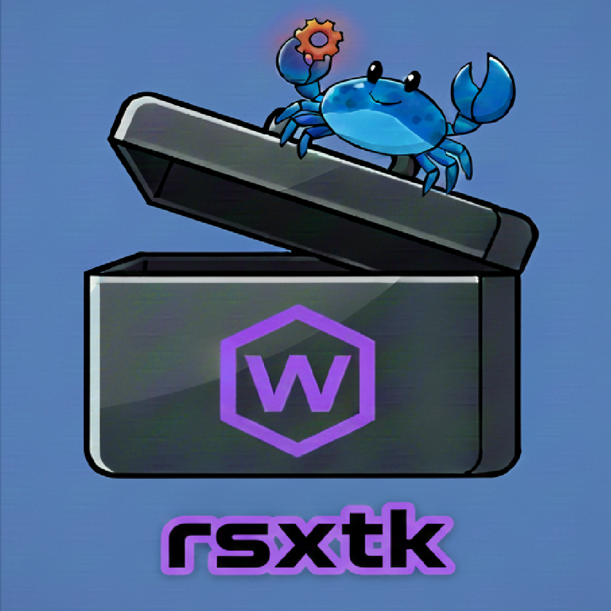

<p align="center">
  
</p>

# rsxtk 🧰

**Rust Script and WebAssembly Toolkit** — A high-performance manager and CLI for building, running, and managing Rust scripts, WebAssembly Text (WAT), and WASI based WASM modules.

## 🚀 Key Features
* **Universal Entry Point**: Run `.rs`, `.wat`, `.wasm` or `.cwasm` files directly.
* **Automatic Pipeline**: Automatically handles `Rust -> WASM -> CWASM` compilation and caching.
* **AOT Performance**: Uses Wasmtime's Ahead-of-Time (AOT) compilation for near-instant execution.
* **Smart Conversion**: Bidirectional conversion between `.wat` (text) and `.wasm` (binary) with auto-naming.
* **Dependency Management**: Add/Remove/List dependencies stored directly in script frontmatter.

---

## 🛠 Installation

Ensure you have the [Rust toolchain](https://rustup.rs/) and the `wasm32-wasip1` target installed:

```bash
rustup target add wasm32-wasip1
```

---

## 📖 Usage Guide

### 1. Running Scripts
You can run a raw Rust script, a WebAssembly Text file, or a binary module. `rsxtk` detects the format and applies the necessary compilation steps automatically.

```bash
rsxtk run main.rs         # Compiles via virtual Cargo and runs
rsxtk run logic.wat       # Compiles WAT to binary and runs
rsxtk run module.wasm     # Pre-compiles to native AOT and runs
```

### 2. Building Modules
Generate specific artifacts for distribution or native execution.

```bash
rsxtk build main.rs wasi  # Generates a portable .wasm file
rsxtk build main.rs cwasm # Generates a native Wasmtime artifact
```

### 3. Converting Formats
Convert between binary and text formats. If no output is provided, it swaps the extension automatically.

```bash
rsxtk convert main.wasm             # Creates main.wat
rsxtk convert main.wat              # Creates main.wasm
rsxtk convert main.wasm -o dev.wat  # Specific output name
```

### 4. Project Initialization
Quickly scaffold new Code scripts or library modules.

```bash
rsxtk init my_script      # Creates my_script.rs with main function
rsxtk init-mod my_lib     # Creates my_lib.rs as a public module (Note: running modules not currently active)
```

### 5. Managing Dependencies
Scripts use a `---` fenced frontmatter block to store dependencies.

```bash
rsxtk add main.rs serde       # Adds the latest serde to the script dependency manifest
rsxtk add main.rs serde 1.0   # Adds serde to the script dependency manifest
rsxtk list main.rs            # Lists current dependencies in the manifest
rsxtk remove main.rs serde    # Removes serde from the script dependency manifest
```

---

## 📋 Command Reference

| Command | Description |
| :--- | :--- |
| `run <path>` | Runs `.rs`, `.wat`, or `.wasm` through the AOT pipeline. |
| `build <path> <target>` | Builds `wasi`, `wasm`, or `cwasm` artifacts. |
| `convert <in> [-o out]` | Converts between `.wat` and `.wasm` (Autonames). |
| `init <name>` | Creates a new script template. |
| `init-mod <name>` | Creates a new module template. |
| `bench <path>` | Benchmarks execution speed over N iterations. |
| `fmt <path>` | Formats the Rust code within the script. |
| `optimize <path>` | Uses `walrus` to shrink WASM file size. |
| `info <path>` | Displays WASM imports and exports. |
| `clean` | Wipes the `.tk` build cache. |

---

## 🌟 Code Examples

### 1. Fibonacci (Rust Script)
Create `fib.rs`:
```rust
---
[dependencies]
---
fn main() {
    let mut a = 0;
    let mut b = 1;
    println!("Fibonacci sequence:");
    for _ in 0..10 {
        println!("{}", a);
        let temp = a;
        a = b;
        b = temp + b;
    }
}
```
**Run:** `rsxtk run fib.rs`

### 2. Hello World (WAT)
Create `hello.wat`:
```wat
(module
  (import "wasi_snapshot_preview1" "fd_write" (func $fd_write (param i32 i32 i32 i32) (result i32)))
  (memory 1)
  (export "memory" (memory 0))
  (data (i32.const 8) "Hello, Rosetta Code!\n")
  (func $main (export "_start")
    (i32.store (i32.const 0) (i32.const 8))
    (i32.store (i32.const 4) (i32.const 21))
    (call $fd_write (i32.const 1) (i32.const 0) (i32.const 1) (i32.const 24))
    drop
  )
)
```
**Run:** `rsxtk run hello.wat`

---

## ⚙️ How it Works
When you run a `.rs` file, `rsxtk` creates a hidden virtual Cargo project in the `.tk/` directory. It manages dependencies, compiles the script to `wasm32-wasip1`, and then pre-compiles that WASM into a native `.cwasm` file for your specific CPU architecture. 

---

## 🛠 Troubleshooting (Windows & Environment)

### 1. "Access is Denied" or "Path Not Found" (UNC Paths)
On Windows, if your project is deep within a folder structure, you may encounter errors related to UNC paths (paths starting with `\\?\`).
* **Solution**: Move the project closer to the root of your drive (e.g., `G:\rsxtk_projects\`).
* **Alternative**: Enable **Long Paths** in Windows via PowerShell (Admin):
  `New-ItemProperty -Path "HKLM:\System\CurrentControlSet\Control\FileSystem" -Name "LongPathsEnabled" -Value 1 -PropertyType DWORD -Force`

### 2. Cargo Build Failures
* Ensure the WASM target is installed: `rustup target add wasm32-wasip1`.
* **Clean Cache**: If builds become corrupted, run `rsxtk clean`.

### 3. Wasmtime Execution Errors
* **Unsupported ELF Header**: Occurs if a `.wat` file wasn't converted or a `.cwasm` is incompatible. Run `rsxtk clean` and try again.

