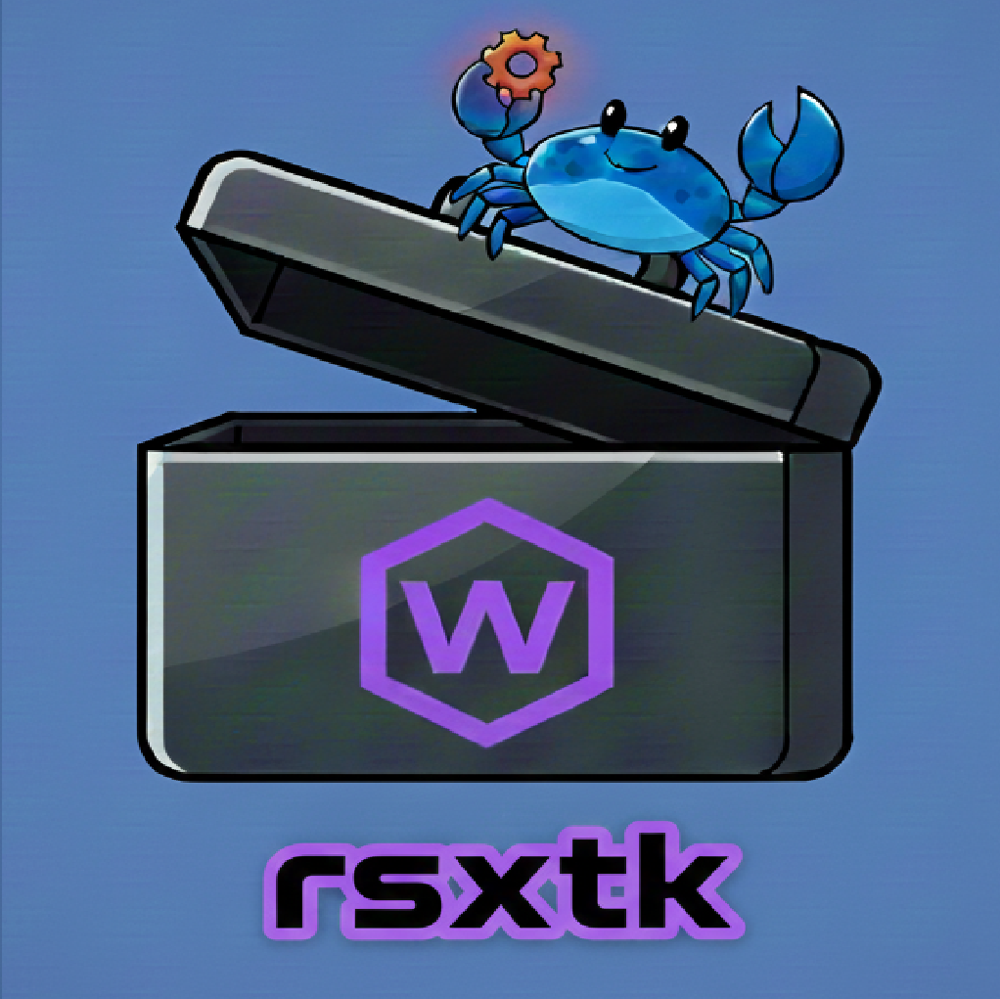

<p align="center">
  
</p>

# rsxtk (Rust Scripting Toolkit) 🦀

`rsxtk` is a high-performance scripting toolkit that allows you to run single Rust files as standalone scripts with automatic dependency management, WASM/WASI compilation, and localized resource support.


---

## Prerequisites

Before installing `rsxtk`, you must have the Nightly Rust toolchain installed on your system. 
**Get started here: [rust-lang.org/learn/get-started/](https://www.rust-lang.org/learn/get-started/)**

Ensure you have the Nightly Rust toolchain
```bash
rustup install nightly
rustup default nightly
```

and `wasm32-wasip1` target installed:

```bash
rustup target add wasm32-wasip1
```

---

## New Features in v0.4.2

-   **⚡ Wasmtime Disk Cache**: The engine now loads the default wasmtime cache config on startup, so repeated runs of the same `.wasm` file skip Cranelift recompilation entirely — matching the behaviour of the `wasmtime` CLI.
-   **📦 Resource Management (`rsc/`)**: A dedicated folder for local assets (HTML, CSV, JSON, etc.) that is automatically mirrored into the build environment.
-   **🔨 build.rs Support**: Automatically detects and utilizes a `build.rs` file located next to your script for complex build instructions.
-   **🔍 Auto-Dependency Versioning**: Adding a dependency via CLI without specifying a version now automatically fetches the latest stable release from Crates.io.
-   **🚀 WASI Preview 1 (v40) Support**: Fully compatible with the latest `wasmtime-wasi` error handling and exit status types.
- **Smart Entry**: Attempts to run via `_start` (WASI). If missing, automatically lists callable functions.
- **Library Mode**: Use `mod` to call specific functions with arguments from the CLI.
- **Rich Metadata**: `info` command provides detailed function signatures (params and return types).
- **Format Support**: Direct support for `.rs`, `.wasm`, `.wat`, and `.cwasm`.
- **Zero-Config WASI**: Scripts are automatically sandboxed to their own parent directory.

---

## Quick Start

### 1. Initialize a Script
```bash
rsxtk init my_script.rs
```

### 2. Add Dependencies
Add a crate (it will automatically find the latest version for you):
```bash
rsxtk add my_script.rs reqwest
```

### 3. Remove Dependencies
Add a crate (it will automatically find the latest version for you):
```bash
rsxtk remove my_script.rs reqwest
```

### 4. Manage Resources
Create a resource directory and place assets (like `index.html`) inside:
```bash
rsxtk resource my_script.rs
```
Place your local dependency files in the newly created `rsc/` folder. You can reference them in your script like this:

### 5. Run (WASM Sandbox)
Compiles to WASM and runs in a secure, sandboxed environment.
```bash
rsxtk run my_script.rs
```

### 6. Csrun (Native Native)
Runs natively on the host using the Cargo script interface.
```bash
rsxtk csrun my_script.rs
```

---

## CLI Command Reference

| Command | Usage | Description |
| :--- | :--- | :--- |
| `init` | `rsxtk init <name>` | Creates a new script with a manifest header. |
| `run` | `rsxtk run <file>` | Runs file in the WASM/WASI sandbox. |
| `csrun` | `rsxtk csrun <file>` | Runs file natively via `cargo -Z script`. |
| `resource` | `rsxtk resource <file>` | Creates an `rsc/` folder for local assets. |
| `add` | `rsxtk add <file> <crate>` | Adds a dependency to the script manifest. |
| `remove` | `rsxtk remove <file> <crate>` | Removes a dependency from the script manifest. |
| `list` | `rsxtk list <file>` | Lists current dependencies in the script. |
| `fmt` | `rsxtk fmt <file>` | Formats the Rust code inside the script (preserving manifest). |
| `build` | `rsxtk build <file> <target>` | Compiles to `wasi`, `wasm`, or `cwasm`. |
| `clean` | `rsxtk clean` | Wipes the `.tk` build cache. |

---

## Technical Details

### The Build Pipeline
When you run a script, `rsxtk` performs the following steps:
1.  **Parsing**: Separates the TOML manifest from the Rust source code using triple-dash boundaries.
2.  **Mirroring**: 
    -   Copies the script into a temporary `Cargo` project inside `.tk/`.
    -   Copies the `rsc/` folder (if present) into the project root.
    -   Copies `build.rs` (if present) into the project root.
3.  **'run' option**    
    - **Compilation**: Invokes `cargo` to target `wasm32-wasip1`.
    - **Optimization**: Pre-compiles the result into a `.cwasm` artifact and caches it. On subsequent runs the compiled module is loaded from the wasmtime disk cache, skipping Cranelift entirely.
    - **Sandboxing**: Runs the artifact in a secure WASI sandbox with the project root pre-opened for file access.
4.  **'csrun' option**: runs the cargo -Z script from the nightly version of rust

---

## 🌟 Code Examples

### 1. Fibonacci (Rust Script)
Create `fib.rs`:
```rust
---
[dependencies]
---
fn main() {
    let mut a = 0;
    let mut b = 1;
    println!("Fibonacci sequence:");
    for _ in 0..10 {
        println!("{}", a);
        let temp = a;
        a = b;
        b = temp + b;
    }
}
```
**Run:** `rsxtk run fib.rs`

### 2. Hello World (WAT)
Create `hello.wat`:
```wat
(module
  (import "wasi_snapshot_preview1" "fd_write" (func $fd_write (param i32 i32 i32 i32) (result i32)))
  (memory 1)
  (export "memory" (memory 0))
  (data (i32.const 8) "Hello, Rosetta Code!\n")
  (func $main (export "_start")
    (i32.store (i32.const 0) (i32.const 8))
    (i32.store (i32.const 4) (i32.const 21))
    (call $fd_write (i32.const 1) (i32.const 0) (i32.const 1) (i32.const 24))
    drop
  )
)
```
**Run:** `rsxtk run hello.wat`

---

## ⚙️ How it Works
When you run a `.rs` file, `rsxtk` creates a hidden virtual Cargo project in the `.tk/` directory. It manages dependencies, compiles the script to `wasm32-wasip1`, and then pre-compiles that WASM into a native `.cwasm` file for your specific CPU architecture. 

---

## 🛠 Troubleshooting (Windows & Environment)

### 1. "Access is Denied" or "Path Not Found" (UNC Paths)
On Windows, if your project is deep within a folder structure, you may encounter errors related to UNC paths (paths starting with `\\?\`).
* **Solution**: Move the project closer to the root of your drive (e.g., `G:\rsxtk_projects\`).
* **Alternative**: Enable **Long Paths** in Windows via PowerShell (Admin):
  `New-ItemProperty -Path "HKLM:\System\CurrentControlSet\Control\FileSystem" -Name "LongPathsEnabled" -Value 1 -PropertyType DWORD -Force`

### 2. Cargo Build Failures
* Ensure the WASM target is installed: `rustup target add wasm32-wasip1`.
* **Clean Cache**: If builds become corrupted, run `rsxtk clean`.

### 3. Wasmtime Execution Errors
* **Unsupported ELF Header**: Occurs if a `.wat` file wasn't converted or a `.cwasm` is incompatible. Run `rsxtk clean` and try again.

### 4. Wasmtime Version Compatibility

`rsxtk` is pinned to **wasmtime 40.x**. Versions 42.x and later reintroduce `aws-lc-sys` into the dependency chain, which requires **NASM** and **cmake** to build. On Windows environments without those tools the build will fail with `Missing dependency: cmake`. Do not upgrade wasmtime until NASM and cmake are available, or until an alternative pure-Rust crypto path is available in that version.
